# Bengali-Fish-Recognizer

<h2>Project Development Journal</h2>

<h3><code style="color:blue">Problem Statement</code></h3>

<strong>A bengali fish image recognizer that can classify in between: -</strong>

    <table>
        <tr>
            <td></td>
            <td></td>
            <td></td>
            <td></td>
        <tr>
        <tr>
            <th>Ayre</th>
            <th>Catla</th>
            <th>Chital</th>
            <th>Ilish</th>
        </tr>
        <tr>
            <td></td>
            <td></td>
            <td></td>
            <td></td>
        <tr>
        <tr>
            <th>Kachki</th>
            <th>Kajoli</th>
            <th>Koi</th>
            <th>Magur</th>
        </tr>
        <tr>
            <td></td>
            <td></td>
            <td></td>
            <td></td>
        <tr>
        <tr>
            <th>Mola Dhela</th>
            <th>Mrigal</th>
            <th>Pabda</th>
            <th>Pangash</th>
        </tr>
        <tr>
            <td></td>
            <td></td>
            <td></td>
            <td></td>
        <tr>
        <tr>
            <th>Poa</th>
            <th>Puti</th>
            <th>Rui</th>
            <th>Shing</th>
        </tr>
        <tr>
            <td></td>
            <td></td>
            <td></td>
            <td></td>
        <tr>
        <tr>
            <th>Silver Carp</th>
            <th>Taki</th>
            <th>Telapia</th>
            <th>Tengra</th>
        </tr>
    </table>

<h3><code style="color:blue">Objective</code></h3>
<strong>There are many kinds of fishes sold in Bangladeshi fish markets. Each of them has their own characteristics.But there are a few that sometimes look alike but can be differentiated using tiny details. Such as, A Catla fish's head size is larger than the Rui's but other features are almost same. Ayre and Pangash both have same body structure but an ayre fish has hackeles whereas pangash doesn't fall in catfish category. There are many fishes like that. The main goal of this recognizer project is to categorize in between them.</strong>

<h3><code style="color:blue">Data Collection</code></h3>
<strong>A bit of exploration made me know that searching a fish with its scientific name gives better result and provides with more accurate images. So, I mapped each fish's bengali and scientific name within a dictionary. Then using fastAI's <a href="https://duckduckgo.com/">DuckDuckGo</a> searching, running a loop within the dictionary, I collected images for each category and kept them in their respective folders. You will found the whole procedure within the "data_collection" notebook.</strong>

<h3><code style="color:blue">Data Cleaning</code></h3>
<strong>There were many redundant images within many categories. In some cases, images were mixed up between catgories. So, before training I not only had to delete those redundant images but also needed to move images to their respective folders. Still, as humen we sometimes fail to do each thing perfect. 

    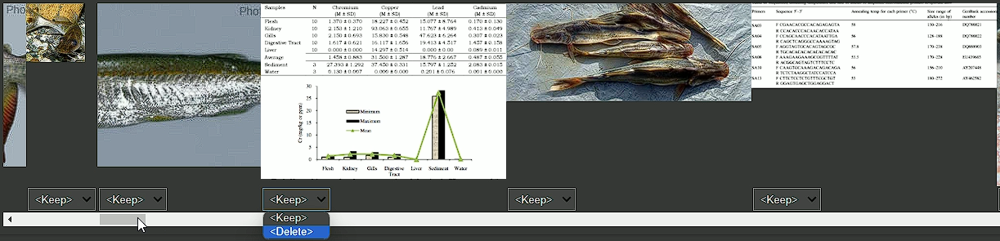 
    

 

After model training, when the results were not satisfactory, I found the classes with most losses and repeated the cleaning process. In the end, if you look at the images distribution table, you will find out that it turned out to be an imbalanced dataset.</strong>
<table align="center">
    <tr>
        <th align="center" colspan="2"><strong>Images Distribution</strong></th>
    </tr>
    <tr>
        <th align="center">Before Cleaning</th>
        <th align="center">After Cleaning</th>
    </tr>
    <tr>
        <td align="center">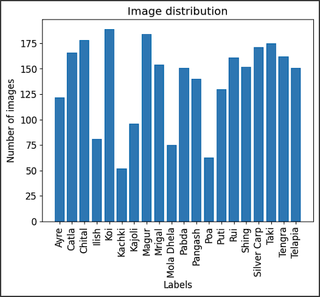</td>
        <td align="center">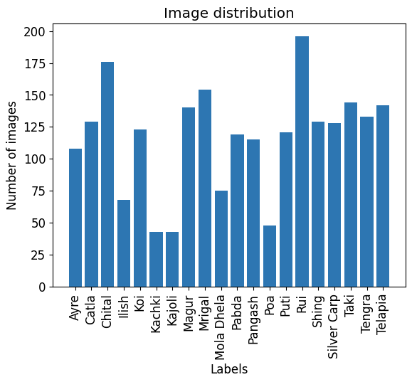</td>
    </tr>
</table>

<h3><code style="color:blue">Dataloader Preparation</code></h3>
<strong>I splitted the whole data to. I prepared the dataloader with a batch size of 32.</strong>

<h3><code style="color:blue">Models Experimentations</code></h3>
<strong>To create the classifier, I chose some pre-trained and well-performing computer vision models with feature extractors avaialable in the fastAI and trained them. I selected these models from my previous research-based experience. The choosen ones are: - 
    <ul>
      <li>VGG-19</li>
      <li>DenseNet-121</li>  
      <li>ResNet-50</li>  
    </ul>
</strong>

<h3><code style="color:blue">Performance Evaluation</code></h3>

<h3><code style="color:blue">Explainablity</code></h3>
<strong>To interpret the model's performances, I applied Grad-CAM, a gradient-based method. Within an image, we can find which region was found important by a model for the predicted class.</strong> 
<table align="center">
    <tr align="center">
        <th colspan="4">Correctly classified visualizations</th>
    </tr>
    <tr align="center">
        <th>Actual Image</th>
        <th>ResNet-50</th>
        <th>DenseNet-121</th>
        <th>VGG-19</th>
    </tr>
    <tr align="center">
        <td>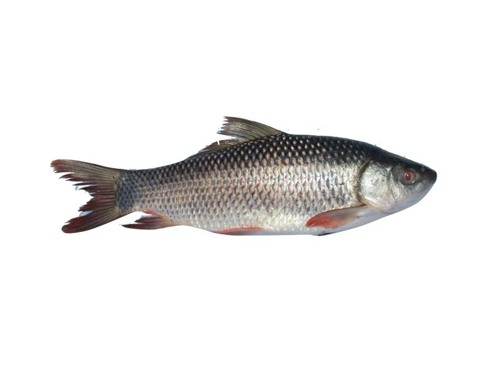</td>
        <td></td>
        <td>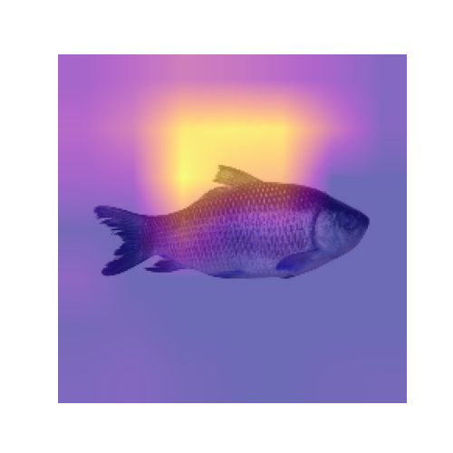</td>
        <td>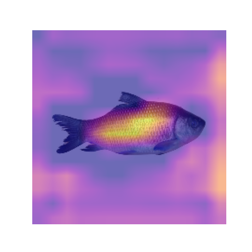</td>
    </tr>
    <tr align="center">
        <td>
Rui
</td>
        <td>
Rui
</td>
        <td>
Rui
</td>
        <td>
Rui
</td>
    </tr>
       <tr align="center">
        <th colspan="4">Mis-classified visualizations</th>
    </tr>
    <tr align="center">
        <th>Actual Image</th>
        <th>ResNet-50</th>
        <th>DenseNet-121</th>
        <th>VGG-19</th>
    </tr>
    <tr align="center">
        <td>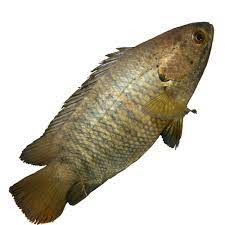</td>
        <td>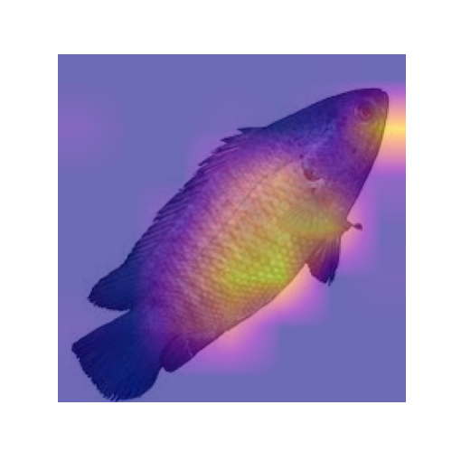</td>
        <td>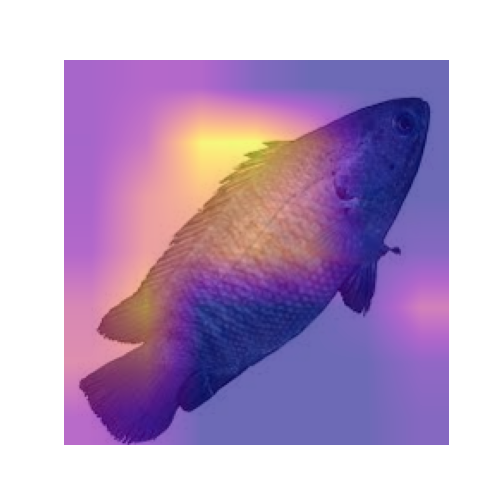</td>
        <td>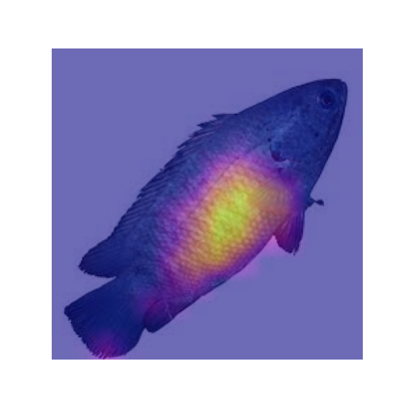</td>
    </tr>
    <tr align="center">
        <td>
Koi
</td>
        <td>
Telapia
</td>
        <td>
Taki
</td>
        <td>
Telapia
</td>
    </tr>
</table>
<strong>By looking at the Resnet-50's xai mask, we can say that it tries to find characteristics properly. For example, in the case of correctly classified image, it's locating regions nearby tail and head, even in the case of misclassification, it's marking more features within body area. But in the case of DenseNet-121, the masked areas are scattered more at outiside in both the cases. Vgg-19 while correctly classifying is locating the middle body area but more areas were masked than the required region. For the misclassification, it located within the image but stil missed the correct label.</strong>           

<h3><code style="color:blue">Deployment</code></h3>
<strong>As ResNet-50 was showing better performance than others. So,I deployed the recognizer using gradio app within Huggingface. Check out the <a href="https://huggingface.co/spaces/nelbarman053/Bengali-Fish-Recognizer">deployment</a> & <a href="https://huggingface.co/spaces/nelbarman053/Bengali-Fish-Recognizer/tree/main">required files</a> for the deployment.</strong> 

    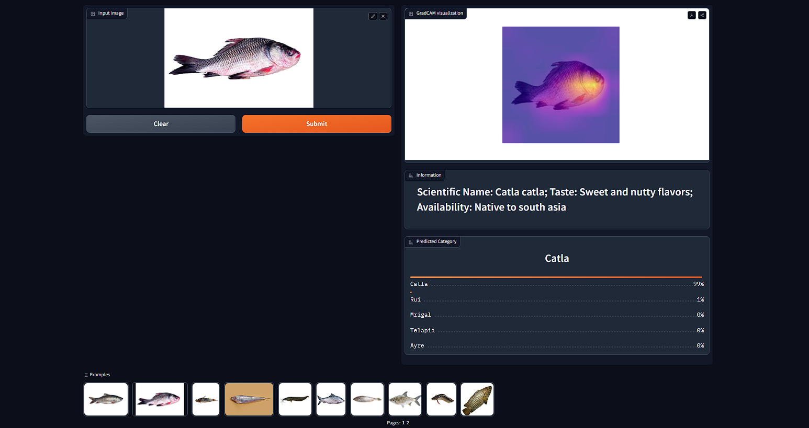

<h3><code style="color:blue">Integration</code></h3>

<strong>The recognizer model is integrated using github pages and jekyll remote theme. 
Check out the ingtegration of <a href="https://neloy-barman.github.io/Bengali-Fish-Recognizer/">Bengali Fish Recognizer</a></strong>
